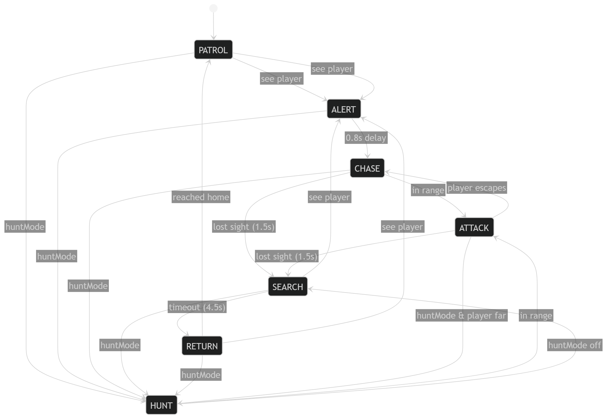

# GHOST PROTOCOL 🕵️

A browser-based top-down stealth game built with HTML5 Canvas and JavaScript.  

\---

## How to Play

|Action|Control|
|-|-|
|Move|`W A S D` or Arrow Keys|
|Aim|Mouse|
|Pause|`ESC`|
|Restart|`R`|
|Confirm / Start|`Space` or `Enter`|

**Objective:** Collect all gold data chips scattered around the map, then reach the **EXIT** circle without being caught by any of the guards.

\---

## Guard FSM

Each guard is controlled by a **Finite State Machine** with 6 states:

|State|Colour|Behaviour|
|-|-|-|
|`PATROL`|🟢 Green|Walks a fixed waypoint loop|
|`ALERT`|🟡 Yellow|Freezes for 0.8 s, "!" pops up|
|`CHASE`|🟠 Orange|Sprints toward the player|
|`ATTACK`|🔴 Red|Strikes the player at close range|
|`SEARCH`|🟣 Purple|Investigates the last known position|
|`RETURN`|🔵 Blue|Returns to starting waypoint|

## Implemented Events

1. `keydown` – movement, ESC pause, R restart, Space/Enter confirm
2. `keyup` – release held movement keys
3. `mousemove` – update player aim direction
4. `click` – menu button, resume pause, restart screens
5. `contextmenu` – suppress browser right-click menu
6. `resize` – refit canvas to new window dimensions
7. `focus` – reserved for manual resume
8. `blur` – auto-pause when window loses focus
9. `visibilitychange` – pause on browser tab switch
10. `requestAnimationFrame` – main game loop
11. Custom: `gameStart`, `gameOver`, `gameWin`, `chipCollected`, `canvasResized`

## Technologies

* HTML5 Canvas API
* Vanilla JavaScript
* CSS3 (@import Google Fonts)